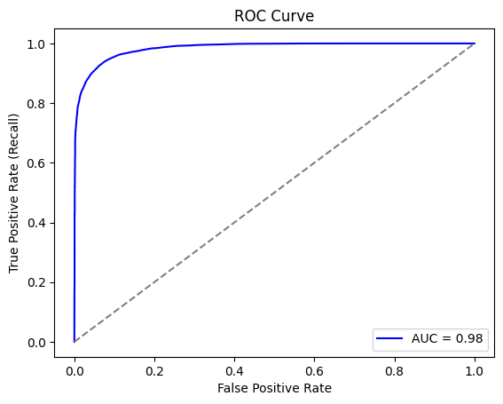
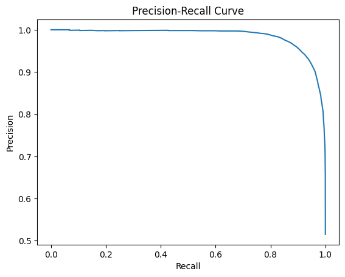
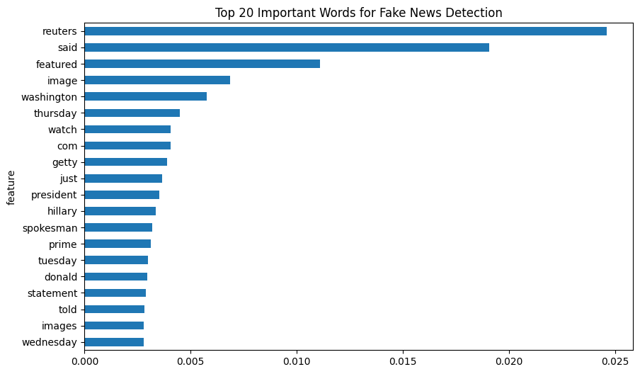

# 📰 Fake News Classifier using NLP

## Project Overview
This project implements a **Fake News Classifier** using Natural Language Processing (NLP) techniques and multiple machine learning models. The primary goal is to classify news articles as either **"Real" (0)** or **"Fake" (1)** based on their `title` and `text` content using the `WELFake_Dataset.csv`.

The notebook demonstrates a complete machine learning pipeline: data loading, cleaning, feature engineering, model training (Naive Bayes, Random Forest, KNN, Logistic Regression, and SVM), and comprehensive performance evaluation.

---

## 💾 Dataset
The project utilizes the **WELFake_Dataset**, which contains over 72,000 news articles and is a merge of four popular news datasets (Kaggle, McIntire, Reuters, BuzzFeed Political).

**Dataset Source:**
[https://www.kaggle.com/datasets/saurabhshahane/fake-news-classification](https://www.kaggle.com/datasets/saurabhshahane/fake-news-classification)

| Column | Description |
| :--- | :--- |
| `title` | The headline of the news article. |
| `text` | The full body text of the news article. |
| `label` | The target variable: **0** for Real News, **1** for Fake News. |

### Class Distribution
The dataset exhibits a good balance between the two classes:
* **Fake News (Label 1):** 37,106 samples
* **Real News (Label 0):** 35,028 samples

---

## 🛠️ Setup and Installation

### Prerequisites
Ensure you have Python installed (version 3.7+ recommended).

### Dependencies
You can install all necessary libraries using the following command:

```bash
pip install pandas numpy scikit-learn nltk seaborn nlp_utils matplotlib
```

### Methodology
 ## 1. Data Preprocessing & Cleaning
-Missing Values: All missing values in the title and text columns were filled with an empty string ("").

-Text Cleaning: The raw text was converted to lowercase and punctuation/numbers were removed.

-Tokenization & Stemming: Stop words (English) were removed, and the Porter Stemmer was applied to reduce words to their base form (e.g., 'running' to 'run').

-Data Split: The dataset was split into 70% training and 30% testing sets (test_size=0.30, random_state=40).


### 2. Feature Engineering
The text data was transformed into numerical features using two primary vectorization methods:

| Vectorizer | Description | Training Matrix Shape (Samples, Features) |
| :--- | :--- | :--- |
| **TF-IDF Vectorizer** | Calculates a weighted score (Term Frequency-Inverse Document Frequency) for each word, prioritizing rare but important words (`max_df=0.7` was used to ignore terms appearing in over 70% of documents). | (50493, 205963) |
| **Count Vectorizer** | Creates a matrix where each entry represents the **frequency** (count) of a word in a given document (Bag-of-Words model). | (50493, 205963) |

## 🤖 Machine Learning Models & Performance Results

### Machine Learning Models Trained
The following classifiers were trained on the processed and vectorized news text features and evaluated on the test set:

* **Naive Bayes (MultinomialNB)**
* **Random Forest Classifier**
* **K-Nearest Neighbors (KNeighborsClassifier)**
* **Logistic Regression**
* **Linear Support Vector Machine (LinearSVC)**

---

### Performance Results

| Model | Vectorizer | Test Accuracy |
| :--- | :--- | :--- |
| **Linear SVM** | TF-IDF | **0.9567 (95.67%)** |
| **Logistic Regression** | Count | **0.9515 (95.15%)** |
| **Random Forest** | Count | **0.9316 (93.16%)** |
| **Naive Bayes** | Count | **0.890 (89.0%)** |
| **K-Nearest Neighbors (KNN)** | Count | **0.7788 (77.88%)** |

### Key Observations

* **Highest Accuracy:** The **Linear SVM** model achieved the best overall performance, demonstrating excellent separation of the classes when using TF-IDF weighting.
* **Vectorization Preference:** For the top models, simple linear classifiers (SVM, Logistic Regression) proved highly effective, indicating that the difference in word choice and weighting (as captured by TF-IDF/Count) is strongly predictive.
* **KNN Limitation:** KNN delivered the lowest accuracy, which is a common issue in text classification when dealing with high-dimensional and sparse feature sets.

### Feature Importance (Random Forest)
The Random Forest model was used to calculate the importance of each word (feature) in the classification process.

****
### 📊 Classification Model Analysis 
## 1. ROC Curve (Receiver Operating Characteristic)
-Purpose: Measures the trade-off between the True Positive Rate (TPR) and False Positive Rate (FPR) at various threshold settings to assess how well the model separates the classes.
-Metric: The Area Under the Curve (AUC). A value of $1.0$ is perfect classification; $0.5$ is random.
-Axes: Y-axis is TPR (Recall), and X-axis is FPR (1 - Specificity).
-Project Context: The Random Forest model showed a high AUC (close to $1.0$), indicating excellent separability and robust performance in distinguishing between Real and Fake news.
<p align="center">
  
</p>

## 2. Precision-Recall CurvePurpose:
Measures the trade-off between Precision and Recall for different classification thresholds. This curve is especially useful when the costs of different errors (False Positives vs. False Negatives) are unequal.
-Precision (Exactness): Out of all predictions made for the positive class (Fake News), how many were correct?
```bash
Formula: TP/(TP + FP)
```
-Recall (Completeness): Out of all actual positive cases (Fake News), how many did the model correctly identify? 
```bash
Formula: TP/(TP + FN)
```
-Project Context: The curve confirmed the model is effective at retrieving most Fake News cases while maintaining high precision.
<p align="center">
  
</p>

## 3. Feature Importance Top Words (Random Forest)Concept: 
In tree-based models like Random Forest, Feature Importance quantifies how much each input feature (a word in the vocabulary) contributed to the overall prediction accuracy across all trees.
<p align="center">
  
</p>
Value: This metric provides model interpretability, highlighting the key linguistic patterns that the model learned.
Insight: Highly weighted words often represent unique vocabulary, partisan terms, or sensationalized language associated with the Fake News class.

